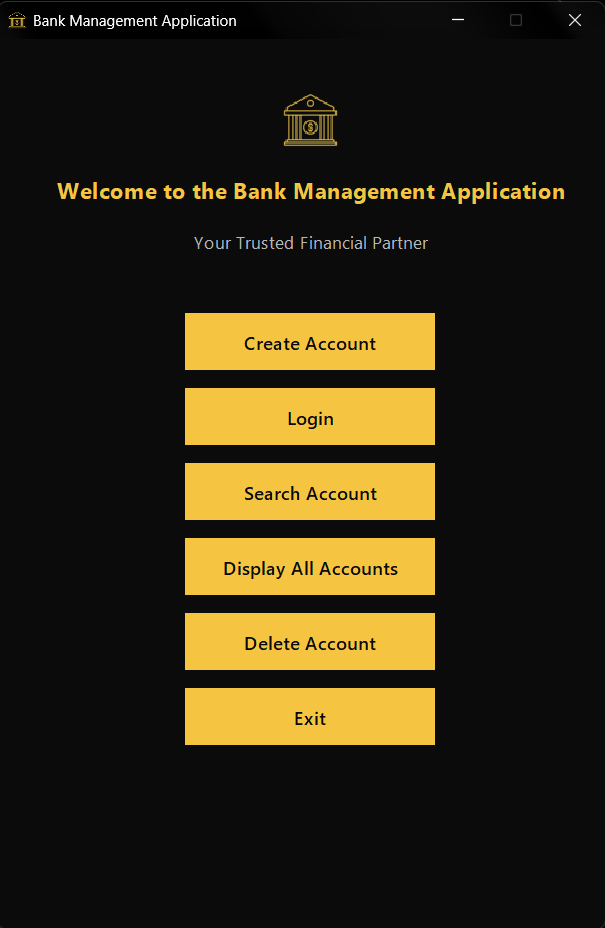
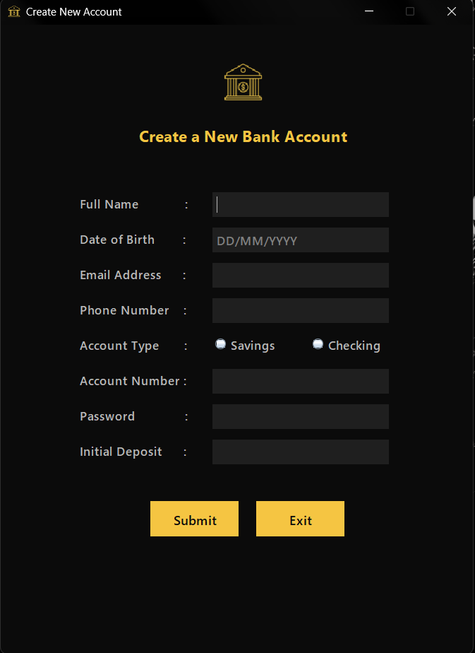
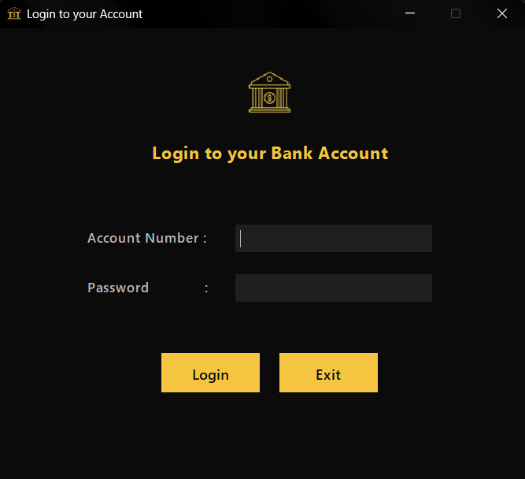
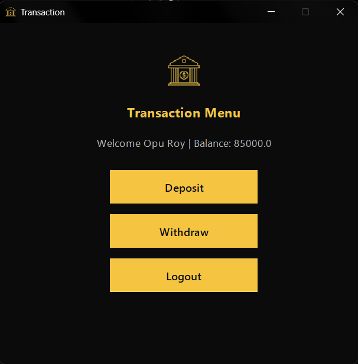
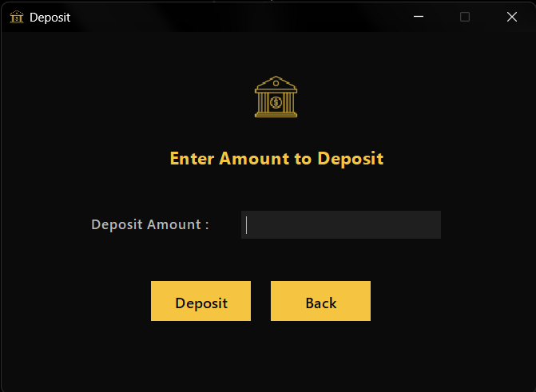
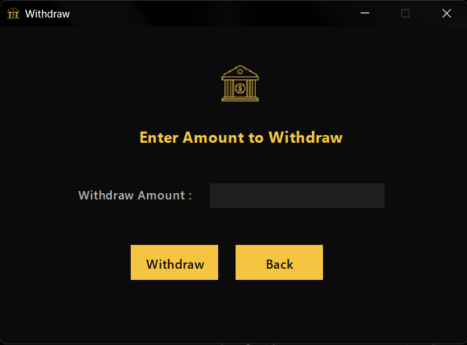
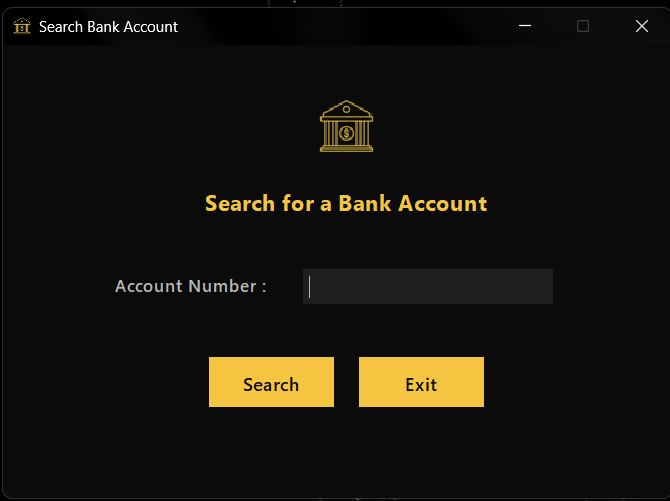
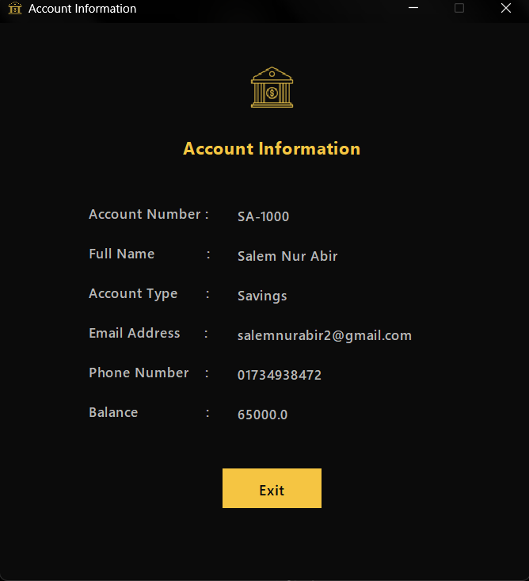
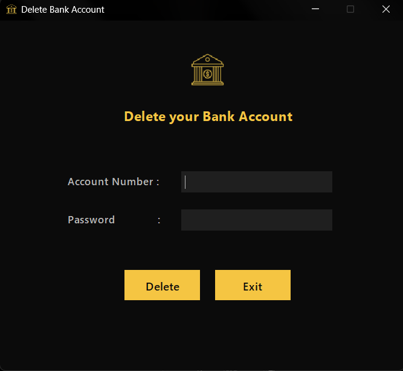
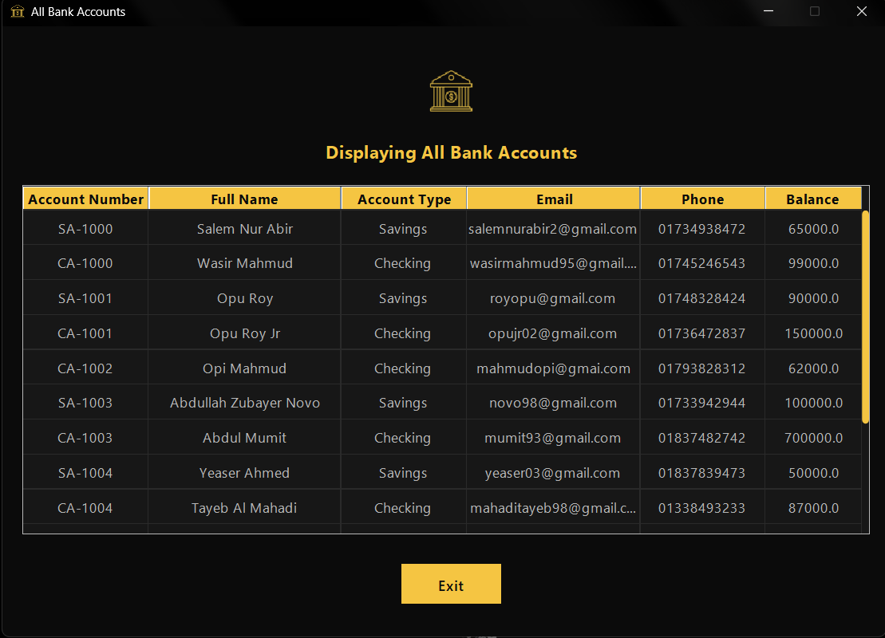

# Bank Management Application

A **Java Swing–based desktop application** for managing bank accounts with a sleek dark-themed interface. This project demonstrates fundamental **object-oriented programming (OOP)**, **file-based data persistence**, and a **modular GUI architecture** using multiple frames.

---

## 👨‍💻 Contributors

- [](https://github.com/ABiR994)

- [](https://github.com/opuroy-62500)

---

## 🎯 Objective

To build a fully functional **desktop banking simulator** that allows users to:

- Create, view, update, and delete bank accounts  
- Perform deposits and withdrawals with account-type-specific rules  
- Store all data in a plain-text file for simplicity and portability  

The application emphasizes clean code structure, consistent UI/UX, and core Java programming best practices.

---

## ✨ Key Features

- ✅ Create **Savings** or **Checking** accounts  
- 🔐 Secure **login** using account number + password  
- 💰 **Deposit** funds with real-time balance update  
- 🏧 **Withdraw** with validation:  
  - *Savings*: Minimum balance enforced at **500**  
  - *Checking*: Overdraft allowed up to **–1000**  
- 🔍 **Search** any account by account number  
- 👁️ **View detailed account information**  
- 📋 **Display all accounts** in a styled scrollable table  
- 🗑️ **Delete accounts** (requires valid credentials)  
- 💾 **Persistent storage** in `./data/accounts.txt` (CSV format)  

> ⚠️ **Note**: Passwords are stored in **plain text**—acceptable for learning, not for production.

---

## 🧠 OOP Principles Used

| Concept         | Implementation |
|----------------|----------------|
| **Encapsulation** | All `Account` fields are `protected`; accessed via public methods |
| **Inheritance**   | `SavingsAccount` and `CheckingAccount` inherit from abstract `Account` |
| **Abstraction**   | Abstract `Account` defines required behavior (`getType`, `canWithdraw`) |
| **Polymorphism**  | Withdraw logic adapts based on runtime account type |

---

## 🛠️ Technologies

- **Language**: Java (JDK 8+)  
- **GUI**: Swing + AWT  
- **Architecture**: Multiple `JFrame` windows (one per screen)  
- **Persistence**: File I/O with `BufferedReader`/`BufferedWriter`  
- **Styling**: Consistent dark theme with custom colors and hover effects  
- **Build**: Pure Java—no external dependencies  

---

## 🗂 Project Structure

```
Bank-Account-Management-System-Single-Page/
│
├── assets/
| ├── screenshots/
│ ├── logo.png
│ ├── logo(50x50).png
│ └── logo(60x60).png
│
├── data/
│ └── AccountFileHandler.java
│
├── model/
│ ├── Account.java
│ ├── SavingsAccount.java
│ └── CheckingAccount.java
│
├── ui/
│ ├── MainFrame.java
│ ├── MenuPanel.java
│ ├── CreateAccountPanel.java
│ ├── LoginPanel.java
│ ├── TransactionPanel.java
│ ├── DepositPanel.java
│ ├── WithdrawPanel.java
│ ├── SearchPanel.java
│ ├── ShowAccountPanel.java
│ ├── ShowAllPanel.java
│ └── DeletePanel.java
│
├── utils/
│ └── Utils.java
│
├── Main.java
├── .gitignore
└── README.md
```

---

## 💾 Data Format

Accounts are stored in `./data/accounts.txt` as **comma-separated values**:

`accountNumber,name,password,accountType,email,phone,balance`

Example:

`SA-1001,John Doe,SecurePass123,Savings,john@email.com,017********,5000`

`CA-1001,Alice Smith,SecurePass456,Checking,alice@email.com,018********,10000`

> ⚠️ **Note**: Passwords are stored in **plain text** for academic simplicity (not suitable for production).

---

## ▶️ How to Run

1. **Clone** or **download** this repository  
2. Open terminal in the **project root directory**  
3. **Compile** all Java files:
   ```bash
   javac ui/*.java model/*.java data/*.java utils/*.java Main.java
   ```
4. Run the program:
   ```bash
   java Main
   ```
>💡 Ensure the `./data/` folder exists (the program will create `accounts.txt` automatically on first save).

---

## 📸 Screenshots

| Menu | Create Account | Login |
|:---:|:---:|:---:|
|  |  |  |

| Transaction | Deposit | Withdraw |
|:---:|:---:|:---:|
|  |  |  |

| Search | Account Details | Delete Account |
|:---:|:---:|:---:|
|  |  |  |

| All Accounts (Table View) |
|:---:|
|  |

---

## 🔚 Summary

This **Bank Management Application** is a desktop banking simulator built with pure Java using Swing for the GUI. It demonstrates core object-oriented programming principles, including encapsulation, inheritance, abstraction, and polymorphism, alongside file-based data persistence and a clean, dark-themed user interface. Designed with modularity in mind, each screen is implemented as a separate `JFrame`, making the code easy to read, maintain, and extend. Ideal for learning Java OOP, file I/O, and desktop UI development.

---
